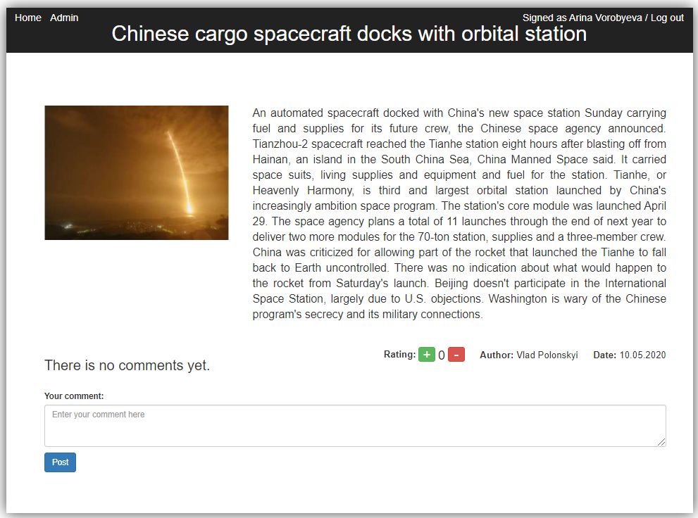

# Лента новостей
Эта лента новостей, разработанная на **JS** с использованием фреймворка **React**. Информация о новостях и зарегистрированных пользователях хранится в файлах **news.json**, **users.json**.

## Запуск кода

Клонируйте репозиторий в папку.

### `npm install`

Загрузите все зависимости.

### `npm start`

Запустите в режиме разработки.

### Функционал:
1. Просмотр ленты новостей с заголовком, сокращенным текстом, автором, датой публикации и рейтингом.

2. Открытие интересующей новости (при нажатии на заголовок) с полным текстом, автором, датой публикации и рейтингом.

3. Добавление комментариев к новостям с указанием автора комментария и даты публикации (только для зарегистрированных и зашедших на сайт пользователей).

4. Сортировка новостей по дате и рейтингу.

5. Проставление пользователем оценок новостям (указание рейтинга).

6. Кнопки: **Sign in** (вход), **Log Out** (выход), **Home** (возврат на стартовую страницу).
7. Возможность зайти от имени пользователя и администратора с указанием имени и фамилии зашедшего.

8. При входе от имени администратора добавляется тестовая страница "Admin page".

9. Указание ошибки, если пользователь не зарегистрирован.

